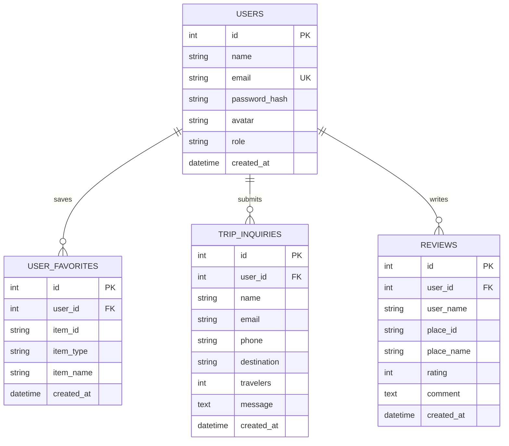

# 🚩 Namaste Karnataka (ನಮಸ್ತೆ ಕರ್ನಾಟಕ)
### *A Full-Stack Digital Cultural Showcase, Tourism Engine & Heritage Platform for Karnataka, India*

<div align="center">

[](https://github.com/DHANUSH141495/NamasteKarnataka-Website)
[](https://opensource.org/licenses/MIT)
[](https://nodejs.org)
[](https://expressjs.com)
[](https://sqlite.org)
[](https://jwt.io)
[](https://developer.mozilla.org)
[]()

**"ಒಂದು ರಾಜ್ಯ, ಹಲವು ಜಗತ್ತು • One State, Many Worlds"**

[Explore Live on GitHub](https://github.com/DHANUSH141495/NamasteKarnataka-Website) • [Report Issue](https://github.com/DHANUSH141495/NamasteKarnataka-Website/issues) • [Request Feature](https://github.com/DHANUSH141495/NamasteKarnataka-Website/issues)

</div>

---

## 📑 Table of Contents
1. [Executive Summary & Vision](#-executive-summary--vision)
2. [Key Platform Features](#-key-platform-features)
3. [Tourism Circuits & Regional Coverage](#-tourism-circuits--regional-coverage)
4. [Culinary Atlas of Karnataka](#-culinary-atlas-of-karnataka)
5. [Living Cultural Heritage & Performing Arts](#-living-cultural-heritage--performing-arts)
6. [Relational Database Architecture](#-relational-database-architecture)
7. [REST API Specification](#-rest-api-specification)
8. [Security & Authentication Architecture](#-security--authentication-architecture)
9. [Frontend Architecture & UI Design System](#-frontend-architecture--ui-design-system)
10. [Repository Structure](#-repository-structure)
11. [Quick Start & Local Setup](#-quick-start--local-setup)
12. [Automated Testing & Verification](#-automated-testing--verification)
13. [Future Roadmap](#-future-roadmap)
14. [Author & Acknowledgments](#-author--acknowledgments)
15. [License](#-license)

---

## 📖 Executive Summary & Vision

**Namaste Karnataka** is an enterprise-grade, full-stack digital tourism engine and cultural chronicle dedicated to preserving, promoting, and exploring the magnificent heritage of the South Indian state of **Karnataka**.

With a history spanning over three millennia—marked by the rule of great dynasties such as the **Kadambas, Chalukyas, Rashtrakutas, Hoysalas, Vijayanagara Emperors, and the Wadiyars of Mysuru**—Karnataka possesses a unique blend of architectural splendors, diverse biodiversity in the Western Ghats (a UNESCO World Heritage bio-hotspot), sun-kissed Arabian Sea beaches, and globally celebrated regional cuisines.

This platform bridges the gap between historical literature and modern digital travelers by providing:
- **Instant multi-attribute search** across 47+ historical destinations.
- **Relational user account system** to bookmark custom itineraries in an SQLite database.
- **Database-backed trip planning engine** for personalized heritage travel inquiries.
- **Interactive educational trivia** showcasing Karnataka's historical milestones and GI-tagged crafts.

---

## ✨ Key Platform Features

| Feature | Description |
| :--- | :--- |
| **🔐 User Authentication** | Full user registration and login powered by `bcryptjs` password encryption and `jsonwebtoken` (JWT) session tokens. |
| **⚡ 1-Click Examiner Demo** | Dedicated 1-click login button for instant viva/demo grading as **Dhanush** (`dhanush@gmail.com` / `Karnataka@123`). |
| **🔍 Search & Filter Engine** | Instant client-side search bar with dedicated **[🔍 Search]** and **[✖ Clear]** buttons, keyboard shortcuts (`Enter`), and category pills. |
| **📍 Google Maps Integration** | Every destination card features an interactive modal with direct GPS coordinates and 1-click Google Maps navigation. |
| **❤️ Database Favorites Sync** | Logged-in users have their bookmarked places and dishes persistently synchronized with the backend SQLite database. |
| **✉️ Trip Inquiry Pipeline** | Integrated travel planning form that captures tourist inquiries directly into the database (`POST /api/inquiries`). |
| **📱 Mobile-First Responsive UI** | Custom CSS Grid and Flexbox layout optimized for smartphones, tablets, laptops, and ultra-wide screens. |
| **🛡️ Resilient Image Fallback** | Automated error recovery system preventing broken images by gracefully falling back to curated high-resolution photography. |

---

## 🗺️ Tourism Circuits & Regional Coverage

The platform catalogues **47+ destinations** grouped into 5 distinct geographic circuits:

### 1. Bengaluru & Central Circuit (Silicon & Garden Capital)
- **Vidhana Soudha**: The seat of state legislature; Neo-Dravidian architectural icon.
- **Lalbagh Botanical Garden**: 240-acre garden commissioned by Hyder Ali, housing the London-inspired Glass House.
- **Cubbon Park**: 300 acres of lush greenery flanked by Attara Kacheri (High Court).
- **Chitradurga Fort**: Seven-walled granite citadel famous for the valor of Onake Obavva.
- **Nandi Hills**: Ancient fortress offering breathtaking cloud-bed sunrise vistas.

### 2. South Karnataka & Mysuru Royal Circuit
- **Mysore Palace (Amba Vilas)**: Official seat of the Wadiyar dynasty; 100,000-bulb illumination during Dasara.
- **Belur & Halebidu**: UNESCO World Heritage Sacred Ensembles of the Hoysala dynasty with soapstone filigree carvings.
- **Shravanabelagola**: 57-foot monolithic granite statue of Lord Bahubali (Gommateshwara) erected in 981 AD.
- **Somanathapura Keshava Temple**: Tri-kuta star-shaped Hoysala architectural marvel.
- **Bandipur & Nagarhole Reserves**: Premier tiger and Asian elephant conservation sanctuaries.

### 3. Coastal Karnataka & Karavali (Sun, Sea & Sanctity)
- **Gokarna**: Sacred Atmalinga at Mahabaleshwara Temple paired with serene Om Beach and Kudle Beach.
- **Murudeshwara**: 123-foot Lord Shiva statue and 20-storey Raja Gopura overlooking the Arabian Sea.
- **Udupi Sri Krishna Matha**: 13th-century monastery founded by Madhvacharya; Kanakana Kindi window.
- **St. Mary's Islands**: National Geological Monument featuring hexagonal columnar basalt rock formations.

### 4. Malnad & Western Ghats Highlands (Coffee & Waterfalls)
- **Coorg (Kodagu)**: The 'Scotland of India' renowned for aromatic coffee plantations, misty hills, and Abbey Falls.
- **Chikmagalur (Mullayanagiri)**: Birthplace of Indian coffee and home to the state's highest peak (1,930 m).
- **Jog Falls (Gerosoppa)**: 253-meter plunge waterfall on the Sharavathi River (Raja, Roarer, Rocket, Rani).
- **Agumbe**: Rainforest research haven, king cobra sanctuary, and 'Cherrapunji of the South'.

### 5. North Karnataka Heritage Circuit (Chalukyan & Adil Shahi Grandeur)
- **Hampi**: UNESCO World Heritage capital of the Vijayanagara Empire; Stone Chariot and Virupaksha Temple.
- **Badami Cave Temples**: 6th-century rock-cut sandstone sanctuaries overlooking Agastya Lake.
- **Pattadakal & Aihole**: The 'Cradle of Indian Temple Architecture' showcasing fusion of Nagara and Dravidian styles.
- **Gol Gumbaz (Vijayapura)**: 2nd largest unsupported dome in the world with an acoustic Whispering Gallery.

---

## 🍲 Culinary Atlas of Karnataka

Karnataka's gastronomic traditions are categorized into distinct regional culinary schools:

| Region | Iconic Dishes | Key Characteristics |
| :--- | :--- | :--- |
| **South Karnataka & Mysuru** | Bisi Bele Bath, Mysore Pak, Ragi Mudde, Mysore Masala Dosa | Pure desi ghee, toor dal, ragi balls, fragrant cinnamon & cloves |
| **Coastal & Karavali (Udupi/Mangaluru)** | Neer Dosa, Kori Gassi, Mangalore Buns, Goli Baje, Kane Fry | Coconut milk, rice crepes, fermented banana puris, coastal spices |
| **North Karnataka** | Jolada Rotti, Ennegayi, Dharwad Peda, Shenga Chutney, Girmit | Jowar flatbreads, stuffed brinjal, roasted peanut powder, caramelized mawa |
| **Malnad & Kodagu** | Pandi Curry, Akki Roti, Kaad Todu, Filter Kaapi | Dark roasted coffee beans, wild bamboo shoots, black pepper |

---

## 🎭 Living Cultural Heritage & Performing Arts

- **Yakshagana (ಯಕ್ಷಗಾನ)**: A 500-year-old theatrical art form featuring high-pitched percussion (*Chande, Maddale*), elaborate facial makeup, regal headgear (*Kireeta*), and extemporaneous mythological dialogues.
- **Dollu Kunitha (ಡೊಳ್ಳು ಕುಣಿತ)**: Powerful drum-dance of the Kuruba community performed with massive cylindrical drums strapped to the chest.
- **Mysore Dasara (ಮೈಸೂರು ದಸರಾ)**: 10-day State Festival (*Nada Habba*) culminating in the grand *Jumboo Savari* procession carrying the 750kg golden howdah.
- **Kambala (ಕಂಬಳ)**: Traditional coastal buffalo sprint race held across muddy slush tracks (*Kare*).
- **Channapatna Wooden Toys (ಚನ್ನಪಟ್ಟಣದ ಬೊಂಬೆಗಳು)**: GI-tagged lacquerware toys handcrafted from ivory wood and colored with natural vegetable dyes.
- **Veeragase (ವೀರಗಾಸೆ)**: Vigorous martial folk dance recounting the legend of Lord Veerabhadra.

---

## 🏛️ Relational Database Architecture

The backend utilizes **SQLite3** running in **Write-Ahead Logging (WAL)** mode with relational integrity constraints:



---

## 🔌 REST API Specification

All backend endpoints are hosted on **`http://localhost:5050`**:

### Authentication Endpoints
| Method | Route | Description | Auth Required |
| :--- | :--- | :--- | :--- |
| `POST` | `/api/auth/register` | Register new user account with bcrypt password hashing | No |
| `POST` | `/api/auth/login` | Authenticate credentials and receive signed JWT token | No |
| `GET` | `/api/auth/me` | Retrieve active profile from Bearer JWT token | **Yes** |

### Favorites & Inquiries Endpoints
| Method | Route | Description | Auth Required |
| :--- | :--- | :--- | :--- |
| `GET` | `/api/favorites` | List user's bookmarked destinations and delicacies | **Yes** |
| `POST` | `/api/favorites/toggle` | Toggle bookmark state for a destination/dish | **Yes** |
| `POST` | `/api/inquiries` | Save a new trip planning inquiry to the database | No |
| `GET` | `/api/inquiries` | Retrieve all inquiries (Admin view) | No |

### Reviews & System Endpoints
| Method | Route | Description | Auth Required |
| :--- | :--- | :--- | :--- |
| `GET` | `/api/health` | System health check and database status | No |
| `GET` | `/api/stats` | Aggregate system metrics (users, inquiries, places) | No |
| `GET` | `/api/reviews/:placeId` | Fetch reviews for a specific destination | No |
| `POST` | `/api/reviews` | Submit a verified user review and star rating | **Yes** |

---

## 🔐 Security & Authentication Architecture

1. **Password Hashing**: Passwords are salted and hashed using **Bcrypt** (`bcryptjs`, 10 rounds of salt generation) before storage.
2. **Stateless JWT Tokens**: Upon successful authentication, a JSON Web Token signed with `HS256` is returned to the client and stored in `localStorage`.
3. **Protected API Middleware**: `authenticateToken` extracts and verifies the `Authorization: Bearer <token>` header for protected actions.
4. **Resilient Dual-Mode Client**: If the Node server is stopped, the client (`auth.js`) gracefully degrades to client-side demo mode to keep static deployments (e.g. GitHub Pages) functional.

---

## 📱 Frontend Architecture & UI Design System

- **Color System**:
  - **Royal Crimson Red**: `#8B0000` (Headers, Primary Buttons, Badges)
  - **Golden Saffron Amber**: `#FFA000` (Nav Borders, Highlights, Accents)
  - **Sandalwood Cream**: `#FDFBF7` (Page Background)
  - **Dark Charcoal**: `#1C1917` (High-Contrast Typography)
- **Typography Hierarchy**:
  - Headings: `Cinzel`, `Noto Sans Kannada` (Google Fonts)
  - Body: `Outfit` (300, 400, 600, 700)
- **Components**:
  - `cards-grid`: Responsive CSS Grid with dynamic card elevation on hover (`transform: translateY(-8px)`).
  - `modal-backdrop`: Blurred overlay with animated pop-in card details.
  - `search-filter-wrapper`: Unified search input + dedicated action button + category pills.

---

## 📁 Repository Structure

```
NamasteKarnataka-Website/
├── server.js                    # Express.js REST API server with SQLite integration
├── auth.js                      # Client authentication & session manager
├── script.js                    # Dynamic datasets (47+ items) & multi-filter search engine
├── style.css                    # Master stylesheet (theme colors, cards, modals, auth)
├── index.html                   # Homepage: Hero banner, stats counter, categories, trivia
├── places.html                  # Destination catalog with search button & category pills
├── foods.html                   # Traditional dishes and regional cuisines explorer
├── culture.html                 # Folk arts, dances, festivals, and handicrafts guide
├── login.html                   # Dedicated user Login and Registration portal
├── test_backend.js              # Automated backend & database test suite
├── package.json                 # Node dependencies and npm scripts
├── database.sqlite              # Relational SQLite database file
├── .gitignore                   # Git exclusion rules (node_modules, WAL locks)
├── place-images/                # Destination photography
├── food-images/                 # Culinary photography
├── culture-images/              # Folk arts and festival images
├── mysore-night.jpg             # Hero banner image of illuminated Mysore Palace
└── README.md                    # Project documentation & setup instructions
```

---

## 🚀 Quick Start & Local Setup

### Prerequisites
- [Node.js](https://nodejs.org) (v18.0.0 or higher)
- [Git](https://git-scm.com)

### 1. Clone the Repository
```bash
git clone https://github.com/DHANUSH141495/NamasteKarnataka-Website.git
cd NamasteKarnataka-Website
```

### 2. Install Backend Dependencies
```bash
npm install
```

### 3. Start the Server & Database
```bash
npm start
```
*Server will start on **`http://localhost:5050`** with the SQLite database automatically initialized.*

### 4. Open in Your Browser
- Open **`http://localhost:5050`** (or open **`index.html`** directly in any modern browser).

---

## 🧪 Automated Testing & Verification

Run the automated 6-step test suite to audit the API endpoints and SQLite database:
```bash
npm test
```

**Expected Test Output**:
```text
🧪 Starting Namaste Karnataka Backend & Database Audit on port 5051
[1/6] GET /api/health -> Status 200 (online)
[2/6] POST /api/auth/register -> Status 201 (Created ID: 2)
[3/6] POST /api/auth/login -> Status 200 (Logged in: Explorer User)
[4/6] GET /api/auth/me -> Status 200 (Role: user)
[5/6] POST /api/favorites/toggle -> Status 200 (Saved: true)
[6/6] POST /api/inquiries -> Status 201 (Inquiry ID: 1)

======================================================
✅ ALL 6 BACKEND & SQLITE DATABASE AUDITS PASSED 100%!
======================================================
```

---

## 🔑 Demo Login Credentials

For evaluators, examiners, and testers:
- **Email**: `dhanush@gmail.com`
- **Password**: `Karnataka@123`
- **Role**: `admin`
*(Or click **"⚡ 1-Click Login as Dhanush"** directly on `login.html`)*

---

## 🗺️ Future Roadmap

- [ ] 🗣️ **Kannada Audio Narration**: Add integrated voice synthesis in Kannada & English for every heritage site.
- [ ] 📍 **Interactive Leaflet / Mapbox Map**: Embed an interactive 3D map with route distance calculations.
- [ ] 🕶️ **Virtual 360° Panoramic Tours**: 360-degree virtual walkthroughs of Hampi, Belur, and Mysore Palace.
- [ ] 🎟️ **Karnataka State Tourism Booking Integration**: Real-time integration with KSTDC bus and package tours.

---

## 👨‍💻 Author & Acknowledgments

- **Lead Developer**: **Dhanush**
- **GitHub Profile**: [@DHANUSH141495](https://github.com/DHANUSH141495)
- **Project Repository**: [https://github.com/DHANUSH141495/NamasteKarnataka-Website](https://github.com/DHANUSH141495/NamasteKarnataka-Website)

Special thanks to the **Karnataka State Tourism Development Corporation (KSTDC)** and the archaeological literature of the **Archaeological Survey of India (ASI)** for historical references.

---

## 📄 License

This project is licensed under the **MIT License** - see the [LICENSE](LICENSE) file for details.

<div align="center">
<strong>✨ ಸಿರಿಗನ್ನಡಂ ಗೆಲ್ಗೆ, ಸಿರಿಗನ್ನಡಂ ಬಾಳ್ಗೆ ✨</strong>
</div>
